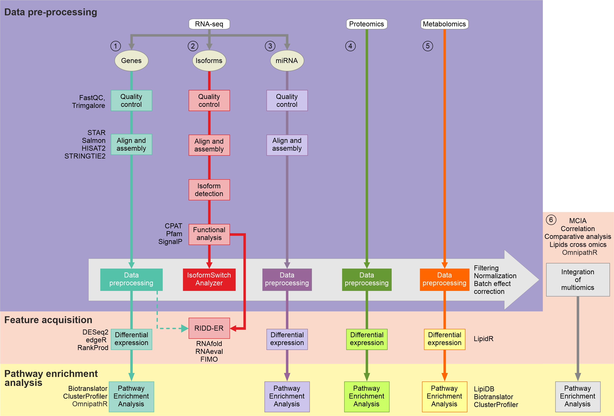
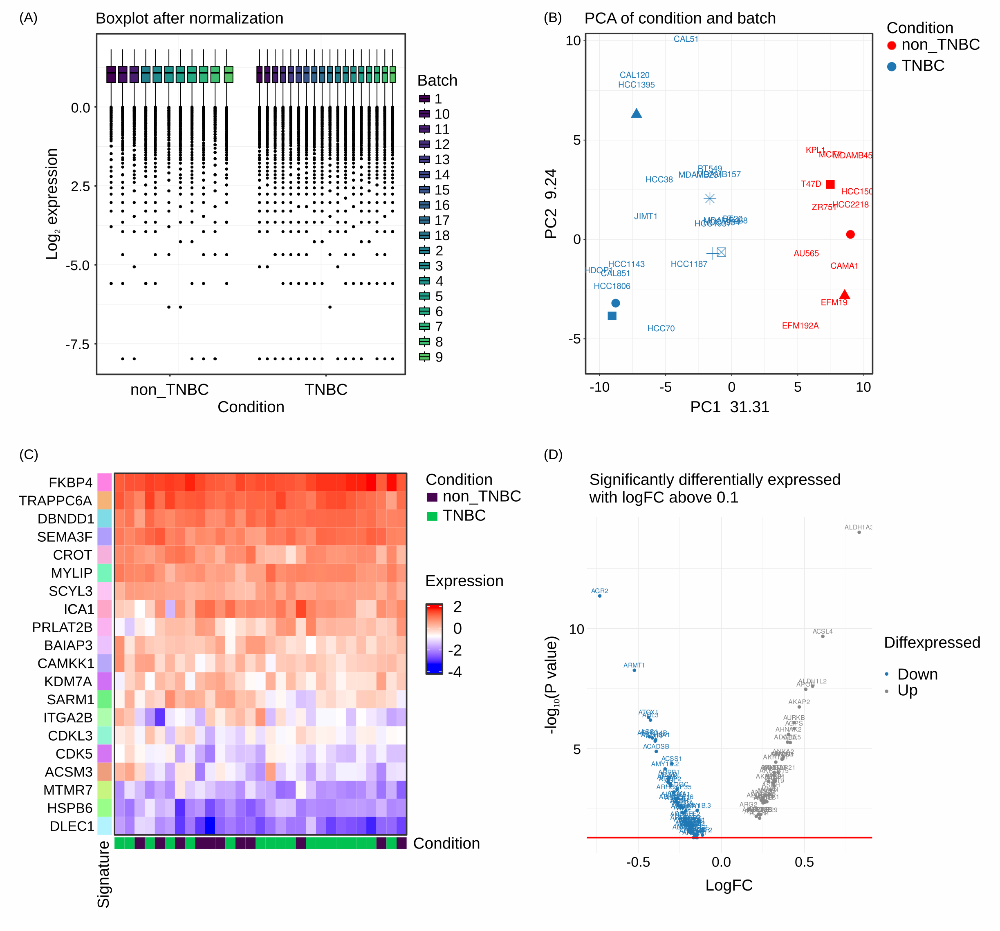
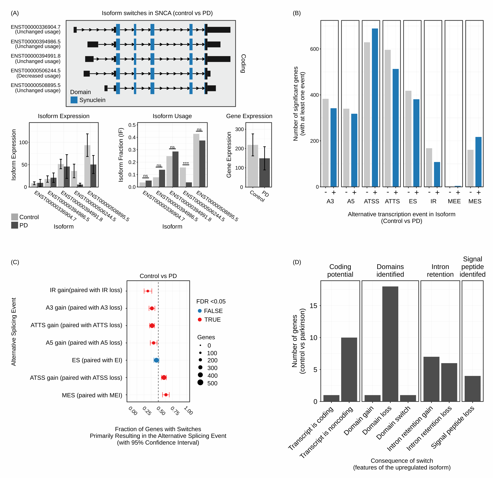
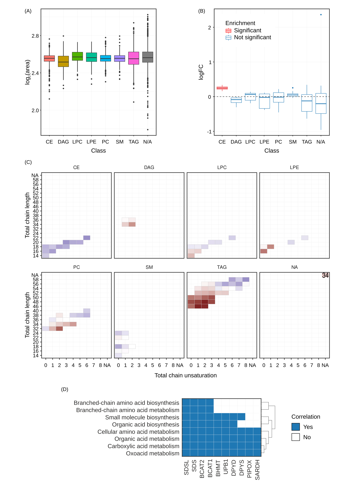
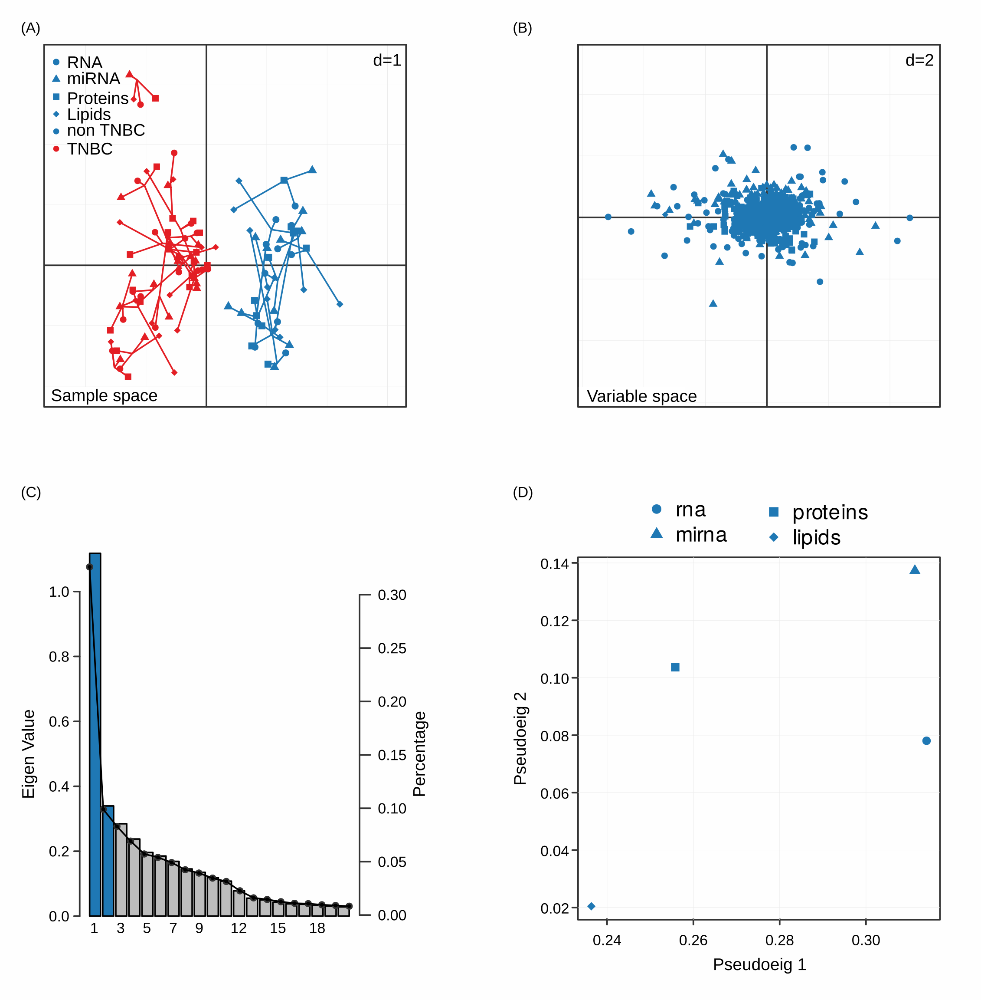
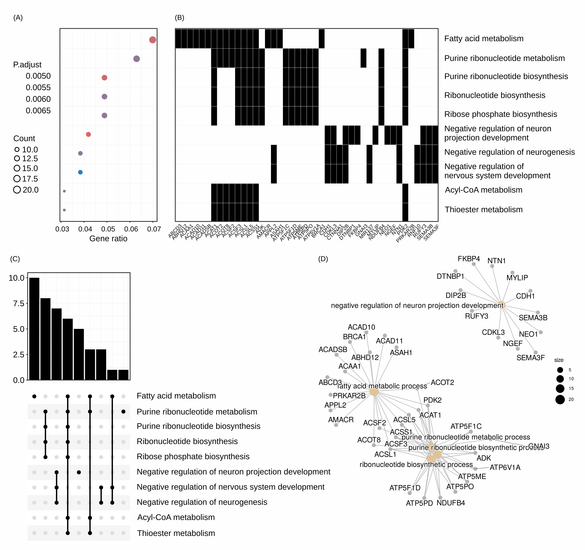
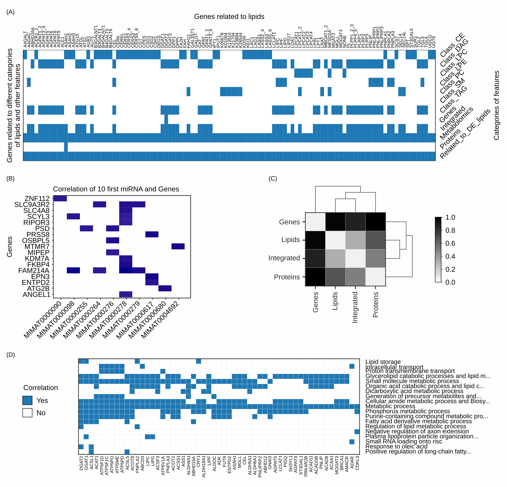
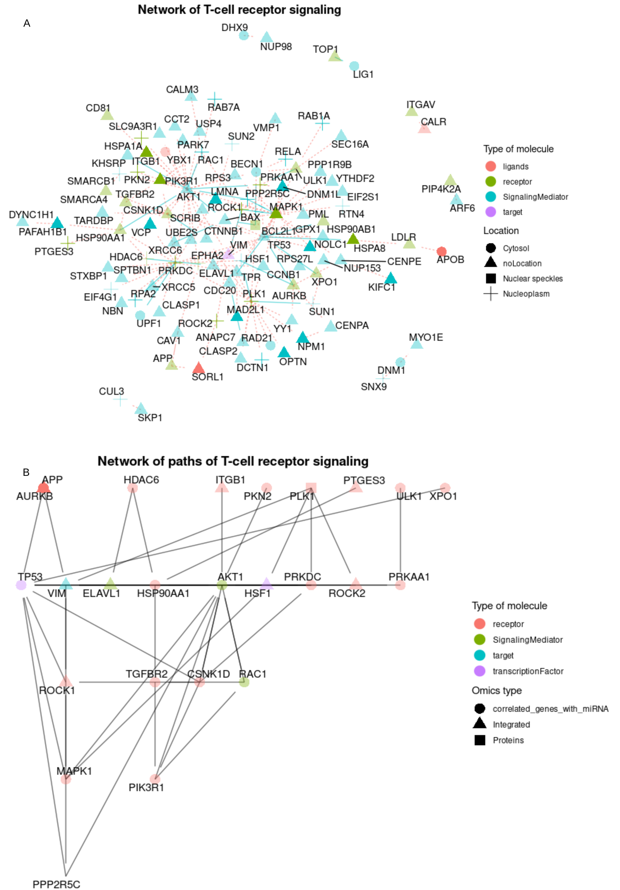

MOI: Output
===========

Introduction
------------

This document describes the outputs produced by MOI pipeline.

The directories listed below will be created in the user's defined results directory
after the pipeline has finished. All paths are relative to the top-level
results directory.

Pipeline overview
-----------------

The pipeline is built using `Nextflow <https://www.nextflow.io/>`__ and
performs the following steps:

1. RNAseq analysis on the level of :

   -  mRNAs
   -  miRNAs
   -  isoforms including lncRNAs

2. Functional annotation of transcripts
3. Lipidomics analysis
4. Proteomics analysis
5. Integration of multi omics data

See diagram: 

RNAseq analysis
---------------

Plots included here are generated from RNAseq data however similar plots
can be generated for proteomic data if provided with a count matrix and
a samples info file:

RNAseq analysis Box plots of samples after filtering and normalizations steps (A) 
as well as PCA plots of raw and cleaned for batch effect samples (B) 
provide quality control of the data. 
Heatmaps (C) and Volcano plots (D) offer visual indications of
differentially expressed features.

.. raw:: html

   

.. raw:: html

   

Output files

.. raw:: html

   

-  ``genes/``

   -  ``filt`` : Directory of filtered matrices.
   -  ``norm`` : Directory of normalized matrices.
   -  ``edger`` (or rankprod or deseq2) : Directory of differentially
      expressed features.
   -  ``clusterprofiler`` : Directory of pathway enrichment analysis
   -  ``biotranslator`` : Directory of pathway enrichment analysis
      performed with biotranslator

.. raw:: html

   

Isoform analysis
----------------

Isoform analysis (A) Different isoforms of
SNCA mRNA are detected and annotated with respect to their coding
potential and protein domains. Moreover, the relative expression of the
gene is displayed along with the relative expression of the isoforms as
well as the fraction of the isoforms used. (B) Bar plots representing
the number of genes encompassing functional implications of isoform
switching. (C) Dot-plots representing which of the functional
implications of isoform switching are statistically significant between
conditions. (D) Bar plots representing the distribution of the
consequences of isoform switching events across genes.

.. raw:: html

   

Output files

.. raw:: html

   

-  ``isoforms/``

   -  ``isopart1``: Directory of first part of analysis from
      isoformSwitchAnalyzer.
   -  ``isopart2``: Directory of second part of analysis from
      isoformSwitchAnalyzer.
   -  ``isovisual`` : Directory of visualization part of analysis from
      isoformSwitchAnalyzer.

.. raw:: html

   

Lipidomics analysis
-------------------

Plots included here are generated if the user chose lipidr = true

`Lipids <png/Fig.4.png>`__ Box plots of the relative fold change
for each class of lipids is displayed (A) along with the output showing
whether that fold change is enriched between conditions (B). The
different classes of lipids shown are ceramides (CE), diglycerides
(DAG), lysophosphatidylcholines (LPC), lysophosphatidylethanolamines
(LPE), phosphatidylcholine (PC), sphingomyelin (SM) and triaglycerides
(TAG). Distribution of saturation levels for each class of lipids is
shown in (C) and the most enriched pathways found using biotranslator in
which these lipids participate is shown in (D).

Otherwise similar plots to those shown in [de_rnaprotmirna] will be
generated.

.. raw:: html

   

.. raw:: html

   

Output files

.. raw:: html

   

-  ``lipids/``

   -  ``lipidr/`` : Directory with extensive lipidomics analysis

.. raw:: html

   

Integration
-----------

Plots included here are generated from RNAseq data however similar plots
can be generated for proteomic data if provided with a count matrix and
a samples info file:

`MCIA <png/Fig.5.png>`__ (A) MCIA reports the PCA of the
sample space where we can see how samples differentiate according to the
phenotype of interest. (B) In addition, variables are projected on the
same space to explore the relative contribution of each variable to the
distinction of the phenotypes. Elbow plots (C) inform us about the
significant principal components and in panel (D) the space of the
pseudo-eigen values of the different datasets is displayed, as an
indication of the relative contribution to the variance observed.

`clusterprofiler <png/Fig.6.png>`__ Clusterprofiler can be
utilized by individual analyses or after the integration step of MCIA.
Outputs include heatmaps of enriched processes (A) and the top features
that participate in these processes (B), as well as tree plots of
significant pathways (C) and the network that these pathways form (D).

.. raw:: html

   

.. raw:: html

   

Output files

.. raw:: html

   

-  ``mcia/``

   -  ``mcia_results/``: Directory of mcia results, including MCIA
      report and analysis from clusterprofiler

.. raw:: html

   

`Additional integration methods and
biotranslator <png/Fig.7.png>`__ 

(A) MOI has unique tools for
associating genes to the molecules found in metabolomic datasets and
visualizing them across functional lipid categories and available omics
data. (B) Correlation analysis performed with Pearson or Spearman can
filter illuminating connection and patterns and aiding the noise
mitigation for downstream analyses like pathway enrichment analysis
(functional analysis). The example provided here shows the top 10
differentially expressed miRNA and their correlated genes. (C) The
semantic distance matrix of feature signatures performed by our
comparative analysis tool explores how closely connected regarding the
biological ontologies are two signatures. (D) shows the biological
processes that hold the most descriptive information of the observed
phenotype, interconnected with hub genes (x axis). ### Pipeline
information

.. raw:: html

   

.. raw:: html

   

Output files

.. raw:: html

   

-  ``pipeline_info/``

   -  Reports generated by Nextflow: ``execution_report.html``,
      ``execution_timeline.html``, ``execution_trace.txt`` and
      ``pipeline_dag.dot``/``pipeline_dag.svg``.
   -  Reports generated by the pipeline: ``pipeline_report.html``,
      ``pipeline_report.txt`` and ``software_versions.yml``. The
      ``pipeline_report*`` files will only be present if the ``--email``
      / ``--email_on_fail`` parameter’s are used when running the
      pipeline.
   -  Reformatted samplesheet files used as input to the pipeline:
      ``samplesheet.valid.csv``.

.. raw:: html

   

Demonstrational data from omnipathr. Visualization of networks of prioritized features. (A) The user can use omnipathr to annotate their network based on various attributes like location (shape), type of molecule (color) and whether or not it belongs to a specific function of interest (Tcell receptor signaling linked with transparency levels). (B) Specific deregulated pathways of the network are shown. The user can also choose to annotate based on the omics of origin of the prioritized features.  

`Nextflow <https://www.nextflow.io/docs/latest/tracing.html>`__ provides
excellent functionality for generating various reports relevant to the
running and execution of the pipeline. This will allow you to
troubleshoot errors with the running of the pipeline, and also provide
you with other information such as launch commands, run times and
resource usage.
